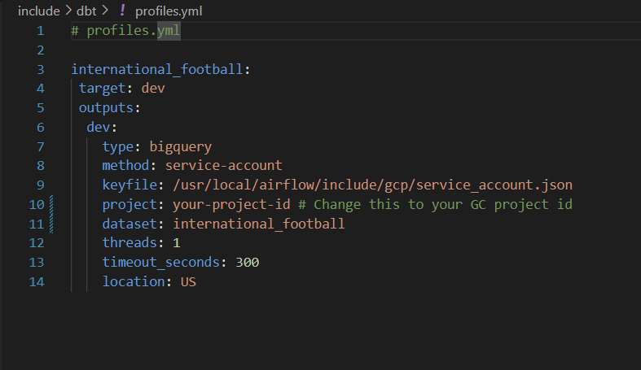
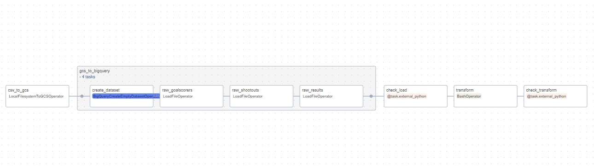
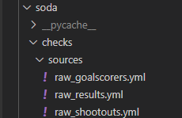

# Dibimbing Data Engineering Batch 2 Final Project


This Airflow data pipeline loads batch data source into cloud data storage, that is GCS and BigQuery, and then the raw dataset quality is checked by Soda Core. After that, the raw dataset is modeled by SQL model files using dbt. Finally, the created tables are checked by Soda Core to ensure the dataset quality for visualization purposes in Metabase. This project used Astronomer CLI because it is a convenient tool set up Airflow in Docker environment.

## Table of Contents

- [Dataset](#dataset)
- [Stacks](#stacks)
- [Prerequisites](#prerequisites)
- [How to Run](#how-to-run)
  - [Installation](#installation)
  - [Configuration](#configuration)
  - [Usage](#usage)
- [Code Explanation](#code-explanation)
- [Results Explanation](#results-explanation)
    - [Load Results](#load-results)
    - [Modelling results and explanation](#modelling-results-and-explanation)
    - [Visualizations](#visualizations)
- [Docker Troubleshooting](#docker-troubleshooting)
- [Conclusion and Future Updates](#conclusion-and-future-updates)

## Dataset
The datasets used in this project are `results.csv`, `shootouts.csv`, and `goalscorers.csv` from [kaggle](https://www.kaggle.com/datasets/martj42/international-football-results-from-1872-to-2017/data). The dataet is about 45,099 results of international football matches starting from the very first official match in 1872 up to 2023. The matches are strictly men's full internationals and the data does not include Olympic Games or matches where at least one of the teams was the nation's B-team, U-23 or a league select team.

### Dataset Information
`results.csv` includes the following columns:

- date (date): date of the match
- home_team (string): the name of the home team
- away_team (string): the name of the away team
- home_score (integer): full-time home team score including extra time, not including penalty-shootouts
- away_score (integer): full-time away team score including extra time, not including penalty-shootouts
- tournament (string): the name of the tournament 
- city (string): the name of the city/town/administrative unit where the match was played
- country (string): the name of the country where the match was played
- neutral (bool) - TRUE/FALSE column indicating whether the match was played at a neutral venue

`shootouts.csv` includes the following columns:
- date (date): date of the match
- home_team (string): the name of the home team
- away_team (string): the name of the away team
- winner (string): winner of the penalty-shootout
- first_shooter (string): the team that went first in the shootout

`goalscorers.csv` includes the following columns:
- date (date): date of the match
- home_team (string): the name of the home team
- away_team (string): the name of the away team
- team (string): name of the team scoring the goal
- scorer (string): name of the player scoring the goal
- own_goal (bool): whether the goal was an own-goal
- penalty (bool): whether the goal was a penalty

## Stacks
- [Docker](https://www.docker.com/): used to containerize and manage the dependencies of various components of the project.
- [Astro CLI](https://docs.astronomer.io/astro/cli/overview): Astro CLI is used to define and manage data pipelines in the project. Astro CLI makes it easy to set up Airflow in Docker environment. 
- [Apache Airflow](https://airflow.apache.org/): used to define, schedule, and monitor workflows of the data pipeline as directed acyclic graphs (DAGs).
- [dbt](https://www.getdbt.com/): used to transform the raw datasets and modelling. 
- [Soda Core](https://www.soda.io/): used to check the data quality of raw datasets and created tables after transforming raw dataset.
- [Metabase](https://www.metabase.com/): used to create visualizations in docker environment.

## Prerequisites

Before you begin, ensure you have met the following requirements:

- [Docker](https://www.docker.com/)
- [Astro CLI](https://docs.astronomer.io/astro/cli/overview)
- [Soda Core](https://www.soda.io/)
- Soda Core account (free trial available)
- Google Cloud account (free credits availabe)

## How to Run

### Installation

1. Clone this repository.
2. Make sure you have met the prerequisites.

### Configuration
Follow these configuration steps to be able to run the application.
1. Create a new project in Google Cloud and choose it.
2. Create a new bucket in GCS and name it as `international_football_results`.
3. Create a new service account
    
    
    
    Name the service account as you like, and then add BigQuery Admin and Storage Admin roles.
    
    
    
    Open the created service account, go to keys, click add key, and create JSON.
    
    
    
    A JSON file will be downloaded. Rename the downloaded JSON file to `service_account`.json and then copy and replace the empty `service_account.json` in the folder `include/gcp/` with it.
4. Copy your Google Cloud project ID
    
    
    
    to change the value of `project_id` of `configuration.yml` in the folder `include/soda/`. 
    
    
    
    After that, in your soda account, create API Keys, copy the `SODA LIBRARY CONFIGURATION` and paste it in the same `configuration.yml`.

    
    
    
    
    Doing this enable soda to send error alert to email and logs to your soda account.
5. Go to the folder `include/dbt/` and change the `project` value in the `profiles.yml` file with your Google Cloud project ID.
    
    
    
    Do the same with database value of `sources.yml` in the folder `include/dbt/models/sources/`
    
    
 
### Usage
1. Make sure Docker is running and open the cloned repository folder in terminal / CMD.
2. Run the `astro dev start` in your terminal:
    ```console
    astro dev start
    ```
    
    
3. Access Airflow UI at localhost in your browser, that is `localhost:8080` and login with `username = admin` and `password = admin`.
    
    
4. Before triggering the DAG, add gcp connection in airflow first.
    Name the connection as `gcp`, choose `Google Cloud` connection type, and then fill the Keyfile Path with `/usr/local/airflow/include/gcp/service_account.json`. Test the connection, and save it if success.
    
    
5. Trigger the DAG. Wait until all tasks are finished.

    

4. Access Metabase UI at localhost in your browser, that is `localhost: 3000` and in the Metabase UI, click `get started`. After that, choose language and you will be asked to create account.

    

    Add dataset from bigquery, add Display name, add GC project ID, and select the `service_account.json` in the folder `include/gcp/`.

    

    For the Usage data preference part, feel free to set it up as you like and then finalize the process. Finally, you are ready to use Metabase.

    
## Code Explanation
The project has one DAG, which is the `international_football.py` at `dags/` which use the `check_function.py` at `include/soda/` as library for soda check tasks. 

Here is the graph of the DAG.



There are 5 tasks:
1. csv_to_gcs: Moves CSV files from the local filesystem to Google Cloud Storage (GCS).
2. gcs_to_bigquery: Creates a BigQuery dataset and loads data from GCS into BigQuery tables.
3. check_load: Runs data quality checks on the raw data.

    This task checks the tables in bigquery based on the Soda Checks Language (.yml) at `include/soda/checks/sources/`.

    

    This task checks if the raw tables which are loaded to bigquery have correct schema.
4. transform: Runs a transformation using dbt.

    This task create several tables based on the dbt SQL model files at `include/dbt/transform/`.
    
    

    All SQL model files transform the raw tables at bigquery which is defined in the `sources.yml` at `include/dbt/sources/`.

5. check_transform: Runs data quality checks on the transformed data.
    
    This task checks the tables in bigquery based on the Soda Checks Language (.yml) at `include/soda/checks/transform/`.

    This task checks if the created tables after transform task are not empty and have correct schema. If a table is empty, it means the SQL model file is incorrect must be fixed.
## Results
### Load results
- Load batch data source to GCS.
    
- Raw datasets from GCS to bigquery.

    

    By soda, the raw datasets have correct schema (each column types are as desired).

### modelling results and explanation


The ERD is:


Table Information:

1. `team_stats`
    - This table represents football teams and their statistics. 
    - Includes the following columns:

        - team_id (integer): team's id.
        - team_name (string): the name of team.
        - total_wins (integer): total match won by the team.
        - total_losses (integer): total match in which team lost.
        - total_goals_scored (integer): total goals scored by team.
        - total_goals_conceded (integer): the team's total of fails to stop an opposing team.
2. `tournament_eras`
    - This table represents a football tournaments and their eras.
    - includes the following columns:

        - tournament_id (integer): id of the tournament.
        - tournament (string): the name of the tournament.
        - team_name (string): the team name which participated in the tournament.
        - eras (string): football era categories based on the match's year group.
    - Can be used to find out the best team of all time or teams that dominated different eras of football.
3. `friendlies`
    - This table represents a table for friendly matches and their results.
    - Includes the following columns:

        - date (date): date of the match
        - home_team (string): a team which is playing on its home ground.
        - away_team (string):  a team playing away from its home ground.
        - tournament (string): name of tournament.
        - result (string): the match's winner.
        - home_team_id (integer): the id of the team which is playing on its home ground.
        - away_team_id (integer): the id of the team which is playing away from its home ground.
        - tournament_id (integer): the tournament's id.
    - Can be used to find out which teams are the most active in playing friendlies and friendlies tournaments. Also, check if friendlies help or hurt (total lost > total won) the team.

4. `results`
    - This table represents a table for match results and their outcomes.
    - includes the following columns:

        - date (date): date of the match
        - home_team (string): a team which is playing on its home ground.
        - away_team (string):  a team playing away from its home ground.
        - home_score (integer): the goals scorred by home team.
        - away_score (integer): the goals scorred by away team.
        - result (string): the match's winner.
        - home_team_id (integer): the id of the team which is playing on its home ground.
        - away_team_id (integer): the id of the team which is playing away from its home ground.
    - Can be used to gain general insights of international football matches. Can also used for gain specific insights by joining with another tables.

5. `tournament_results`
    - This table represents a table for tournament matches and their results.
    - includes the following columns:

        - date (date): date of the match
        - home_team (string): a team which is playing on its home ground.
        - away_team (string):  a team playing away from its home ground.
        - result (string): the match's winner.
        - home_team_win (string): 'Yes' if home team won ('No' if lost).
        - home_team_id (integer): the id of the team which is playing on its home ground.
        - away_team_id (integer): the id of the team which is playing away from its home ground.
    - Can be used to check how much, if at all, does hosting a major tournament help a country's chances in the tournament. Also to check if home teams have advantage.

### Visualizations

## Docker Troubleshooting

### DAG task fails
- If csv_to_gcs fails, then it could be because you have not created the gcs bucket or maybe your gcs bucket name is not "international_football_results". Create "international_football_results" bucket and follow the configuration steps to set up the `secret_account.json`.
- If other task fails, make sure you have followed the confifuration steps. 

### Error alert after `astro dev start` finished


You can ignore this error alert if the `containers are healthy`.


If there is any unhealthy containers, then changing the version of astro-runtime in Dockerfile might be able to fix the problem.

## Conclusion and Future Updates
Overall, the program worked as intended. However, the program still has many possibilites of improvement, for example:

- Improve and/or fix the data models.
- Implementing the astronomer cosmos for dbt modelling to get detailed transformation flow process.
- Update the data source by web scraping football matches.
- Implement DataHub for DataGovt (Lineage, Catalog, etc).
